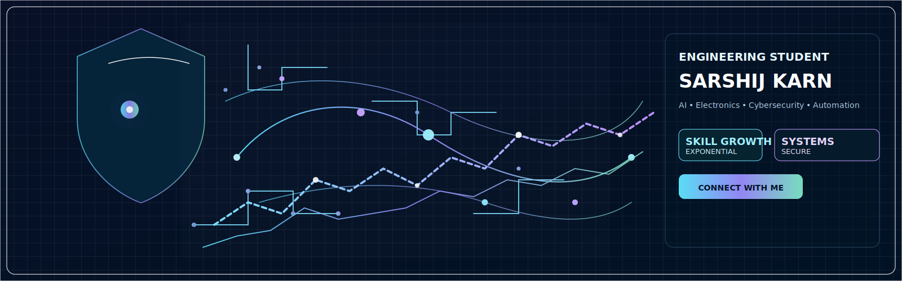

<h1 align="center">
  
</h1>

  <!-- Link to the local resume PDF file -->
  

  

  

---

<h2 align="center">
  
</h2>

<ul>
  <li>🔍 Highly curious about <b>AI, automation, embedded systems, and cybersecurity</b></li>
  <li>🧠 Focused on <b>learning, experimenting, and creating smart solutions</b></li>
  <li>💡 Skilled in leveraging <b>AI tools, programming, and electronics</b> for practical innovation</li>
  <li>⚡ Constantly improving <b>problem-solving, coding, and analytical skills</b></li>
</ul>

---

### 🛠️ Tech Stack & Tools

  

---

### 📊 GitHub Stats & Activity

  
  

---
